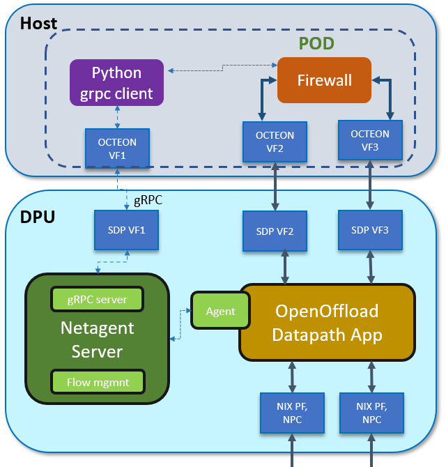

# openoffload PoC

Demo based on openoffload opensource project, see [openoffload](https://github.com/att/sessionOffload).

## GRPC client example

Client code example is located at [client](https://github.com/att/sessionOffload/blob/master/tests/basic/sessions_client.py)

## GRPC server example

Server code example is located at [server](https://github.com/att/sessionOffload/blob/master/tests/basic/sessions_server.py)

## protobuf API

protobuf API is located at [protobuf](https://github.com/att/sessionOffload/blob/master/protos/openoffload.proto
)

## PoC execution

For python PoC execution please follow [example](https://github.com/att/sessionOffload/blob/master/tests/pythonSimulator/README.md)

## Generic SmartNIC Architecture

[Architecture] (https://github.com/att/sessionOffload/blob/master/doc/SmartNIC_Arch.md)

## High level architecture with Octeon DPU

